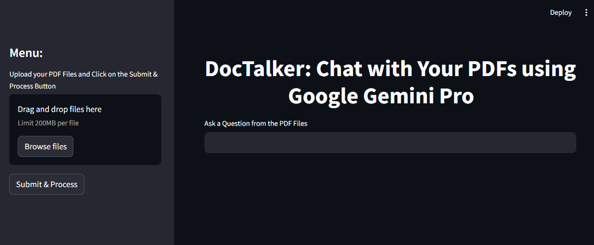

# DocTalker

DocTalker is a document-upload-and-chat application powered by Gemini Pro, Embedding, LangChain, and FAISS. It allows users to upload documents, extract and store their content, create embeddings, and interact with the content through a chat interface using Streamlit.

## Features

- **Upload Documents**: Supports uploading of PDF documents.
- **Extract Text**: Automatically extracts text from uploaded documents.
- **Store Content**: Saves document content and embeddings in FAISS.
- **Generate Embeddings**: Uses LangChain to generate embeddings for the extracted content.
- **Chat with Documents**: Leverages Gemini Pro to enable interactive chat with the document content.

## Tech Stack

- **Python**: Programming language used for backend logic
- **Streamlit**: Framework used for creating the web application UI
- **PyPDF2**: Library for extracting text from PDF files
- **LangChain**: Framework for managing text splitting and vector stores
- **FAISS**: Facebook AI Similarity Search library for vector embeddings
- **Google Gemini Pro**: Gemini-pro model for generating conversational responses


## Project Structure

```plaintext
doctalker/
├── app.py
├── requirements.txt
├── .env
└── README.md
```
## Installation

1. Clone the repository:
    ```sh
    git clone https://github.com/Uma-dev99/DocTalker.git
    cd DocTalker
    ```

2. Install the required packages:
    ```sh
    pip install -r requirements.txt
    ```

3. Run the Streamlit app:
    ```sh
    streamlit run app.py
    ```


## Usage

1. Upload PDF files using the sidebar.
2. Once uploaded, the application processes the PDF and creates vector embeddings.
3. You can then ask questions in the main interface and get responses based on the content of the uploaded PDFs.

## Example Screenshot

Here’s an example screenshot of the application in action:




## Contributing

Contributions are welcome! Please open an issue or submit a pull request.

## License

This project is licensed under the MIT License.

